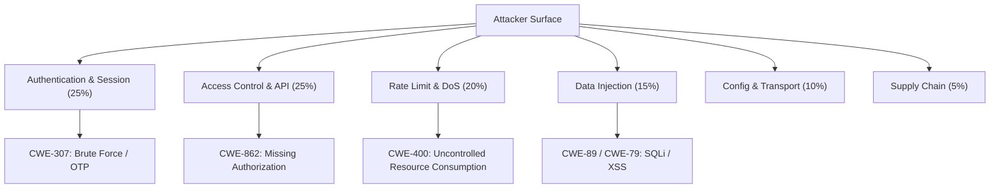

# System Security Audit & Cyber Threat Assessment Report

**Target Environment:** TracelyTag Application (Web Platform & API Gateway)  
**Framework Standards:** OWASP Top 10 (2021), NIST SP 800-30, CWE / CVE Guidelines  
**Audit Date:** August 11, 2026  
**Status:** Confidential / Security Baseline Assessment  

---

## 1. Executive Summary

This Security Audit evaluates the architectural resilience, threat landscape, and vulnerability exposure of the **TracelyTag** web ecosystem. The assessment evaluates attack surface vectors using standard cybersecurity frameworks (OWASP, Common Weakness Enumeration - CWE, Common Vulnerabilities and Exposures - CVE guidelines) and estimates relative risk likelihood distribution across major threat vectors.

### Overall Risk Profile Distribution (Estimated Threat Surface Exposure)

| Threat Vector Category | Relative Likelihood % | OWASP Top 10 Category | Severity Rating |
| :--- | :---: | :--- | :--- |
| **Authentication & OTP Bypass Risks** | 25% | A07:2021 – Identification & Authentication Failures | HIGH |
| **Broken Access Control & Authorization** | 25% | A01:2021 – Broken Access Control | HIGH |
| **Public Endpoint Abuse / Rate Limit Exhaustion** | 20% | A04:2021 – Insecure Design / Denial of Service | MEDIUM-HIGH |
| **Injection & Input Validation** | 15% | A03:2021 – Injection (SQLi, XSS) | MEDIUM |
| **Security Misconfigurations & Environment Controls** | 10% | A05:2021 – Security Misconfiguration | LOW-MEDIUM |
| **Third-Party Dependency & Supply Chain Risks** | 5% | A06:2021 – Vulnerable and Outdated Components | LOW |

---

## 2. Threat Vector Breakdown & CVE/CWE Alignment

---

### Threat Vector 1: Authentication & Identification Weaknesses (25% Exposure)

#### CVE/CWE Standards Alignment
- **CWE-307:** Improper Restriction of Excessive Authentication Attempts
- **CWE-287:** Improper Authentication
- **CWE-799:** Improper Control of Interaction Frequency

#### Analysis & Exposure Scenarios
1. **Optional OTP Verification Configuration:**
   - *Risk Mechanics:* Turning off OTP verification for customer scans or user login removes multi-factor verification, increasing reliance purely on standard credentials or raw link tokens.
2. **OTP Generation & Lifetime Weaknesses:**
   - *Risk Mechanics:* Standard 6-digit numeric OTPs have a search space of $10^6$ ($1,000,000$ combinations). Without strict per-email and per-IP rate limiting or short expiration windows (e.g., 3-5 minutes), automated scripts can iterate through combinations.

#### Defensive Remediation & Hardening Controls
- **Mandatory Account Lockout & Rate Limits:** Implement Redis- or memory-backed sliding window rate limiters (e.g., maximum 5 OTP attempts per email/IP per hour).
- **Cryptographically Secure RNG:** Ensure OTP codes use `crypto.randomInt` rather than `Math.random()`.
- **Short Lifetime & Single-Use Enforcement:** Invalidate OTP payloads immediately upon first verification or after 3 minutes.

---

### Threat Vector 2: Broken Access Control & Privilege Escalation (25% Exposure)

#### CVE/CWE Standards Alignment
- **CWE-862:** Missing Authorization
- **CWE-639:** Authorization Bypass Through User-Controlled Key (IDOR)
- **CWE-284:** Improper Access Control

#### Analysis & Exposure Scenarios
1. **Unprotected Endpoint Exposure:**
   - *Risk Mechanics:* Exposing sensitive system configuration getters (e.g., `/api/system-config`) publicly allows unauthenticated users to enumerate feature toggles and system state.
2. **Role-Based Access Control (RBAC) Enforcement Gaps:**
   - *Risk Mechanics:* If privilege checks are checked only on the client side (e.g., checking `user.role === "super_master"` in React components) without strict backend middleware enforcement (`requireRole("super_master")`), malicious actors can forge API requests directly.

#### Defensive Remediation & Hardening Controls
- **Server-Side Enforcement:** Enforce backend middleware validation (`requireAuth`, `requireRole`) on every sensitive endpoint. Never trust client-declared roles.
- **Principle of Least Privilege:** Restrict unauthenticated endpoints strictly to public verification data and omit internal flags or diagnostic attributes.
- **IDOR Protection:** Use unpredictable GUIDs or scoped database queries (`WHERE company_id = ?`) to prevent unauthorized cross-tenant data access.

---

### Threat Vector 3: Resource Exhaustion & Denial of Service (20% Exposure)

#### CVE/CWE Standards Alignment
- **CWE-400:** Uncontrolled Resource Consumption
- **CWE-770:** Allocation of Resources Without Limits or Throttling

#### Analysis & Exposure Scenarios
1. **Public Code Verification Spamming:**
   - *Risk Mechanics:* Public verification endpoints (`/api/codes/public/:serial`) are accessible to unauthenticated users. High-volume automated queries can exhaust server CPU, memory, or database connection pools.
2. **Placeholder Database Record Creation:**
   - *Risk Mechanics:* Automatically creating placeholder database records on invalid code lookups can lead to database bloat if targeted by malicious automated traffic.

#### Defensive Remediation & Hardening Controls
- **Global & Route-Specific Rate Limiting:** Implement `express-rate-limit` across all public API routes (e.g., max 30 requests per minute per IP).
- **CAPTCHA Protection:** Require reCAPTCHA or Cloudflare Turnstile for public code verification forms after 3 consecutive attempts.
- **Read-Only Verification Lookups:** Avoid writing database records on invalid lookup attempts; log anomalies asynchronously via memory buffers.

---

### Threat Vector 4: Injection & Input Sanitation (15% Exposure)

#### CVE/CWE Standards Alignment
- **CWE-89:** Improper Neutralization of Special Elements used in an SQL Command ('SQL Injection')
- **CWE-79:** Improper Neutralization of Input During Web Page Generation ('Cross-site Scripting')

#### Analysis & Exposure Scenarios
1. **SQL Injection (SQLi):**
   - *Risk Mechanics:* Occurs when raw SQL strings are concatenated with untrusted input. (Mitigated by ORMs like Drizzle ORM when using parameterized queries).
2. **Stored & Reflected Cross-Site Scripting (XSS):**
   - *Risk Mechanics:* Unsanitized user inputs (e.g., customer names, locations) rendered into administrative dashboards can execute arbitrary JavaScript in administrative browser contexts.

#### Defensive Remediation & Hardening Controls
- **Parameterized Query Enforcement:** Always use ORM schema builders (`eq()`, `and()`, parameter binding) and avoid raw SQL string concatenation.
- **Context-Aware Output Encoding:** Ensure React automatically escapes JSX rendering strings and apply Content Security Policy (CSP) headers via `helmet`.
- **Strict Input Validation:** Use Zod schemas to validate format, length, and content of all incoming payload parameters.

---

### Threat Vector 5: Security Misconfigurations & Exposure (10% Exposure)

#### CVE/CWE Standards Alignment
- **CWE-200:** Exposure of Sensitive Information to an Unauthorized Actor
- **CWE-319:** Cleartext Transmission of Sensitive Information
- **CWE-538:** Insertion of Sensitive Information into Log File

#### Analysis & Exposure Scenarios
1. **Verbose Debug Endpoints:**
   - *Risk Mechanics:* Endpoints exposing environment details, system specs, runtime statistics, or internal IDs present information disclosure risks.
2. **Missing Security Headers:**
   - *Risk Mechanics:* Absence of HSTS, X-Frame-Options, or Content-Security-Policy enables clickjacking or downgrade attacks.

#### Defensive Remediation & Hardening Controls
- **Environment Isolation:** Disable verbose debug routes (`/codes/debug/recent`, `/system/info`) in production environments (`process.env.NODE_ENV === "production"`).
- **Security Headers Implementation:** Integrate `helmet` middleware in Express to apply HSTS, X-Content-Type-Options, and X-Frame-Options.
- **Secure Cookies:** Set `httpOnly: true`, `secure: true`, and `sameSite: "strict"` on all session and temporary cookies.

---

### Threat Vector 6: Vulnerable Dependencies & Supply Chain Risks (5% Exposure)

#### CVE/CWE Standards Alignment
- **CWE-1395:** Dependency on Vulnerable Third-Party Component
- **CWE-1104:** Use of Unmaintained Third-Party Components

#### Analysis & Exposure Scenarios
- *Risk Mechanics:* Third-party npm libraries may introduce known CVE vulnerabilities if left unpatched.

#### Defensive Remediation & Hardening Controls
- **Automated Security Audits:** Run `pnpm audit` / `npm audit` in CI/CD build pipelines (e.g., Jenkins, GitHub Actions).
- **Lockfile Enforcement:** Commit `pnpm-lock.yaml` to ensure reproducible builds with verified dependency hashes.

---

## 3. Recommended Defensive Implementation Plan Matrix

| Action Item | Defense Category | Priority | Recommended Timeframe |
| :--- | :--- | :---: | :---: |
| Apply `express-rate-limit` to `/api/auth/*` and `/api/codes/public/*` | Rate Limiting | High | Immediate |
| Ensure strict backend `requireRole` check on system configuration edits | Access Control | High | Immediate |
| Disable or protect `/system/info` and `/codes/debug/*` in production | Information Disclosure | High | Immediate |
| Add CAPTCHA verification to Public Code Scan form | Anti-Automation | Medium | Short-term |
| Enable `helmet` HTTP security headers in Express app | Hardening | Medium | Short-term |
| Schedule periodic `pnpm audit` in CI/CD pipeline | Supply Chain | Low | Ongoing |

---
*Report compiled for TracelyTag System Defense & Security Baseline Assessment.*
